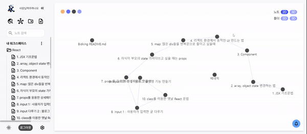

# Ziglog


## 📖목차

- [Ziglog](#ziglog)
  - [📖목차](#목차)
  - [프로젝트 진행 기간](#프로젝트-진행-기간)
  - [❤ 팀 소개](#-팀-소개)
    - [팀명](#팀명)
    - [팀원 소개](#팀원-소개)
  - [🎉 프로젝트 요약](#-프로젝트-요약)
  - [✨주요 기능 및 구현](#주요-기능-및-구현)
  - [🖥 서비스 화면](#-서비스-화면)
  - [🏗️ 아키텍쳐](#️-아키텍쳐)
  - [🛠 기술 스택](#-기술-스택)
  - [💻 Communication Tool](#-communication-tool)
  - [⚙️ SKILL STACK](#️-skill-stack)
    - [🧷 프론트엔드](#-프론트엔드)
    - [🧷 백엔드](#-백엔드)
    - [🧷 인프라](#-인프라)
  - [📂 파일 구조](#-파일-구조)
  - [📝 설계 문서](#-설계-문서)
    - [ERD](#erd)
    - [API](#api)
    - [FIGMA](#figma)
  - [📚 컨벤션](#-컨벤션)
    - [Ground Rule](#ground-rule)
  - [🥇 프로젝트 수칙](#-프로젝트-수칙)
    - [💻 회의 진행](#-회의-진행)
    - [💻 코드 리뷰](#-코드-리뷰)
    - [💻 코드 작성](#-코드-작성)
    - [💻 깃 관리](#-깃-관리)
    - [Git Commit](#git-commit)
    - [Git Branch](#git-branch)
- [브랜치 명명 컨벤션](#브랜치-명명-컨벤션)
  - [Git flow](#git-flow)
    - [Codding](#codding)
    - [Jira](#jira)
  - [💻 구동 방법](#-구동-방법)
  - [💾 결과물](#-결과물)
    - [UCC](#ucc)
    - [시연 영상](#시연-영상)

---

## 프로젝트 진행 기간

`2023.10.10 ~ 2023.11.17 (약 7주)`

---

## ❤ 팀 소개

### 팀명

> 📢 안녕하세요! 지식그래프

### 팀원 소개

|                           Backend                            |                           Backend                            |                           Frontend                           |                          Frontend                           |                          Frontend                           |                          Frontend                           |
| :----------------------------------------------------------: | :----------------------------------------------------------: | :----------------------------------------------------------: | :---------------------------------------------------------: | :---------------------------------------------------------: | :---------------------------------------------------------: |
|  |  |  |  |  |  |
|          [임수형(팀장)](https://github.com/sulogc)           |           [박영서](https://github.com/Frog-Slayer)           |           [김성용](https://github.com/yongseong2)            |           [김하늘](https://github.com/hanulkimm)            |            [이정민](https://github.com/hyuna333)            |            [정현아](https://github.com/hhyeona)             |

---

## 🎉 프로젝트 요약

💡 **프로젝트 명**: Ziglog

**목적**: 지식그래프를 활용한 마크다운 노트 필기 웹 서비스

**기대효과**:

- 쉬운 마크다운 문법을 이용한 지식 정리
- 참조 관계를 활용한 효율적인 지식 관리
- 폴더 관계를 활용한 효율적인 노트 관리

  **차별점**:

- 노\* : 폴더관계가 명확하지 않고 그래프를 이용한 탐색기능이 없음
- 옵시\*언 : 로컬 서비스이고 다른 사용자의 노트를 확인할 수 없음

  => Ziglog: 웹 + 그래프 서비스를 제공

---

## ✨주요 기능 및 구현

💡 **로그인 및 회원가입**:

1.  소셜 로그인(Kakao, Google)

💡 **그래프 탐색**:

1.  노트 기반 2D, 3D
2.  폴더 기반 2D, 3D

💡 **폴더 탐색기**:

1.  폴더와 노트를 탐색하는 사이드바

💡 **검색**:

1. 공개 설정이 적용된 전체 노트 검색
2. 사용자의 내 노트 탐색

💡 **노트 생성 및 수정**:

1.  실시간 마크다운 문법을 변환해주는 에디터 제공
2.  해당 노트를 참조하고 있는 노트를 북마크에서 선택할 수 있는 기능

💡 **노트 읽기**:

1.  마크다운을 파싱한 화면 제공

💡 **라이트모드/다크모드**:

1.  사용자의 눈을 보호하기 위한 밝기 변환 기능 제공

💡 **알림**:

1.  타사용자가 내 글을 참조하거나, 북마크를 할 때 알림 기능 제공

💡 **개인정보 수정**:

1.  사용자의 프로필 이미지, 닉네임을 수정하는 기능 제공

---

## 🖥 서비스 화면

<summary>메인 페이지</summary>
<div markdown="1">
<!--  -->

</div>

<summary>개인 페이지- 노트 그래프</summary>
<div markdown="1">


</div>

<summary>개인 페이지-폴더 그래프</summary>
<div markdown="1">


</div>

<summary>개인 페이지-노트 읽기</summary>
<div markdown="1">
<!--  -->

</div>

<summary>개인 페이지-노트 수정, 참조</summary>
<div markdown="1">


</div>

<summary>검색 페이지</summary>
<div markdown="1">


</div>

---

## 🏗️ 아키텍쳐


---

## 🛠 기술 스택

## 💻 Communication Tool

     

<br><br>

## ⚙️ SKILL STACK

### 🧷 프론트엔드

      

**Language |** Typescript

**Framework |** Next.js

**Engine |** Node.js

**Package Manager |** Yarn Berry

**Library |** Redux Toolkit, Tailwind CSS, Storybook, [return-fetch](https://return-fetch.myeongjae.kim/?ref=blog.deering.co), [react-md-editor](https://github.com/uiwjs/react-md-editor), [react-force-graph](https://github.com/vasturiano/react-force-graph)

<br><br>

### 🧷 백엔드

     

**Language |** Java 17

**Framework |** Spring Boot 2.7

**Data(RDBMS) |** Spring-Data-JPA 2.7.14, MySQL 8.0, Query DSL 5.0

**Cache |** Redis 2.7.14

**Build Tool |** Gradle 8.3

**Test |** Junit 5.8.2, Mockito 4.5.1, JaCoCo 0.8.10
<br><br>

### 🧷 인프라

      

**Infra |** AWS EC2, Nginx, Sonarqube

**DB |** H2, MySQL 8

**CI/CD |** Git, Jenkins

<br><br>

---

## 📂 파일 구조

<details  style="margin-left: 5px;">
<summary><b>프론트 프로젝트 구조</b></summary>
<div>

```
📦app
 ┣ 📂(pages)
 ┃ ┣ 📂oauth
 ┃ ┣ 📂search
 ┃ ┗ 📂user-page
 ┃   ┗ 📂[userNickname]
 ┃     ┣ 📂edit-note
 ┃     ┃ ┗ 📂[noteId]
 ┃     ┗ 📂read-note
 ┃       ┗ 📂[noteId]
 ┣ 📂api
 ┃ ┣ 📂bookmark
 ┃ ┣ 📂folder
 ┃ ┣ 📂graph
 ┃ ┣ 📂note
 ┃ ┣ 📂notification
 ┃ ┣ 📂quote
 ┃ ┣ 📂search
 ┃ ┗ 📂user
 ┣ 📂components
 ┃ ┣ 📂common
 ┃ ┣ 📂main
 ┃ ┣ 📂search
 ┃ ┗ 📂userPage
 ┃   ┣ 📂Notification
 ┃   ┣ 📂QuotationModal
 ┃   ┣ 📂Search
 ┃   ┗ 📂SideBar
 ┃     ┗  📂Directory
 ┣ 📂src
 ┃ ┣ 📂design
 ┃ ┣ 📂fonts
 ┃ ┣ 📂hooks
 ┃ ┗ 📂util
 ┣ 📂store
 ┗  ┗  📂modules

```

</div>
</details>
<br>
<details  style="margin-left: 5px;">
<summary><b>백엔드 프로젝트 구조</b></summary>
<div>

```

```

</div>
</details>

---

## 📝 설계 문서

### ERD

<details>
<summary>ERD</summary>
<div markdown="1">       
   
</div>
</details>

### API

<details>
<summary>전체 문서</summary>
<div markdown="1">       
    
</div>
</details>

<details>
<summary>Request</summary>
<div markdown="1">       
    
</div>
</details>

<details>
<summary>Response</summary>
<div markdown="1">       
    
</div>
</details>

### FIGMA

<details>
<summary>WIREFRAME</summary>
<div markdown="1">       
  <!--  -->
</div>
</details>

---

## 📚 컨벤션

### Ground Rule

<details>
  <summary>클릭하여 내용 표시/숨기기</summary>

> GROUND RULE

## 🥇 프로젝트 수칙

### 💻 회의 진행

1. 매일 오전 9시, 오후 5시 2회에 걸쳐 **데일리 스크럼(Daily Scrum)**을 진행해, 개인별 당일 목표를 설정하고 진행 상황을 공유합니다.
2. 매주 금요일 오후 5시에 **스프린트 세션(Sprint Session)**을 진행해 일주일간 프로젝트의 진행 상황 및 추후 진행 목표를 설정합니다.
3. 데일리 스크럼과 스프린트 세션은 팀장이 회의를 주재하고, 다른 팀원들이 돌아가며 회의록을 작성합니다.
4. 회의에 적극적으로 참여하고, 팀장의 지목에 따라 본인의 의견을 반드시 제시합니다.

### 💻 코드 리뷰

1. **코드 리뷰(Code Review)**는 점심시간을 활용해 필요한 부분만 간단히 30분 동안 진행합니다.
2. 서로 다른 코드 스타일을 합의한 **코딩 컨벤션(Coding Convention)**에 따라 일원화합니다.
3. 코드 리뷰는 우선순위에 따라 빠르게 진행하며, 사소한 의견을 반영할 지에 대한 부분은 코드 작성자가 선택할 수 있도록 합니다.

### 💻 코드 작성

1. 에러(Error)가 발생 시 1시간 정도는 혼자서 고민해보고, 해결이 되지 않을 경우 팀원들과 바로 공유합니다.
2. 에러를 해결하기 위해 고민한 내용 및 해결 과정은 노션에 정리하여 공유합니다.
3. 코드에 **주석(Comment)을 작성**하는 습관을 생활화하여, 다른 팀원들이 내가 작성한 코드를 이해하기 쉽도록 합니다.
4. 기능의 구현 원리를 공부하고 파악하기 위해서 오픈 소스(Open Source) 라이브러리 사용을 최소화하는 것을 원칙으로 합니다.

### 💻 깃 관리

1. 풀리퀘스트(Pull Request)가 있을 경우, 이를 확인했다는 의미에서 최소한 1개 이상의 의견을 남겨야 합니다.
2. 풀리퀘스트 시 의견 갈등이 생겼다면, 충분한 토론과 의견 수렴 과정을 거쳐 **다수의 의견**을 따라야 합니다.
3. 커밋(Commit)하기 전에 고칠 부분을 한 번 더 점검합니다.
4. 1가지 기능 또는 1가지 함수를 새로 만들 때마다 커밋하는 습관을 생활화합니다.
5. **커밋 메시지(Commit Message)**는 합의한 **커밋 컨벤션(Commit Convention)**에 따라 최대한 상세하게 작성합니다.
6. 깃 브랜치(Branch) 규칙에 따라 브랜치를 관리하고, 모든 작업은 올바른 브랜치에서 작업해야 합니다.

</details>

### Git Commit

<details>
  <summary>클릭하여 내용 표시/숨기기</summary>
    
> COMMIT CONVENTION
>

- **Commit 메세지 구조**
  - ex) ✨ feat : Add sign in page #S09P11A308-52

```
<emoji> <type> : <subject> <Jira ticket number> // 필수
// 빈 행으로 구분
<body>      // 생략가능
// 빈 행으로 구분
<footer>    // 생략가능
```

</details>

### Git Branch

<details>
  <summary>클릭하여 내용 표시/숨기기</summary>

# 브랜치 명명 컨벤션

> BRANCH NAMING CONVENTION

## Git flow

- ex) **feat/{이슈 키}-{BE/FE}-{이슈 요약}**

- **master** / **main** - 제품으로 출시 및 배포가 가능한 상태인 브랜치 → 최종 결과물 제출 용도
- **develop** - 다음 출시 버전을 개발하는 브랜치 → 기능 완성 후 중간에 취합하는 용도
- **feature** - 각종 기능을 개발하는 브랜치 → feat/login, feat/join 등으로 기능 분류 후 작업
- **hotfix** - 출시 버전에서 발생한 버그를 수정하는 브랜치

</details>

### Codding

<details>
  <summary>클릭하여 내용 표시/숨기기</summary>

> CODING CONVENTION

- 1문자의 이름은 사용하지 않는다.
- 네임스페이스, 오브젝트, 함수 그리고 인스턴스에는 camelCase를 사용한다 `ex) camelCase`
- 클래스나 constructor에는 PascalCase를 사용한다. `ex) PascalCase`
- 약어 및 이니셜은 항상 모두 대문자이거나 모두 소문자여야 한다. `ex) NFT`
- 클래스명과 변수명은 `명사 사용`
- 메서드명은 `동사 사용`
- 상수명은 대문자를 사용하고, 단어와 단어 사이는 \_로 연결한다.
- component는 PascalCase를 사용한다.

</details>

### Jira

<details>
  <summary>클릭하여 내용 표시/숨기기</summary>

> JIRA CONVENTION

1. 매주 월요일 오전 스크럼 회의 이후 각자의 이슈 티켓을 생성한다.
2. 이슈 생성 시 확인해야 할 부분
   - 담당자가 본인으로 설정되어 있는지
   - **컴포넌트**가 지정되어 있는지 (FE, BE, 공통 중 택1)
   - **Epic Link**가 지정되어 있는지 (설계, FE개발, BE개발, 회의, 학습…)
   - 스프린트의 **총 Story Points가 40 이상**인지
3. 이슈 티켓 이름은 [말머리] 구체적인 기능으로 적는다.
   - 기능 관련 이슈일 경우 [말머리]는 기능 명세서의 대분류를 따른다.
4. 매일 오전 스크럼 회의 이후 그 날 처리할 이슈 티켓을 **진행 중**으로 이동시킨다.
   - 실시간으로 이슈를 처리할 때마다 **완료** 처리한다.

</details>

## 💻 구동 방법

[포팅메뉴얼 참조](./exec/Porting_Manual.md)

---

## 💾 결과물

### UCC

https://youtu.be/tOWOvG0jEx8

### 시연 영상

https://youtu.be/VuCEGz8ChjA
